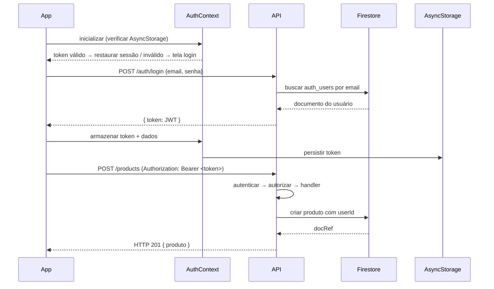

# Documento de Design Técnico — user-auth-roles

## Visão Geral

Esta feature integra autenticação JWT com controle de acesso baseado em perfil (RBAC) ao aplicativo React Native (Expo) com backend Node.js/Express e Firebase/Firestore. O objetivo é conectar a infraestrutura já existente no backend (rotas `/auth`, middlewares `autenticar` e `autorizar` em `protect.js`) ao frontend, aplicar as regras de acesso em todas as rotas e persistir a sessão do usuário no dispositivo via `AsyncStorage`.

### Três níveis de acesso

| Perfil       | Descrição                                                                 |
|--------------|---------------------------------------------------------------------------|
| `admin`      | Gerencia usuários (CRUD completo). Acessa lista de usuários.              |
| `usuario`    | Gerencia apenas seus próprios produtos. Acessa lista de produtos.         |
| Visitante    | Não autenticado. Somente leitura de produtos (`GET /products`).           |

### Fluxo de alto nível



---

## Arquitetura

### Camadas do sistema

```
┌─────────────────────────────────────────────────────────┐
│                    React Native App                      │
│  ┌──────────────┐  ┌──────────────┐  ┌───────────────┐  │
│  │  Telas de    │  │  Telas de    │  │  Telas de     │  │
│  │  Auth        │  │  Usuários    │  │  Produtos     │  │
│  │  (Login,     │  │  (admin)     │  │  (usuario /   │  │
│  │  Cadastro)   │  │              │  │  visitante)   │  │
│  └──────┬───────┘  └──────┬───────┘  └──────┬────────┘  │
│         │                 │                  │           │
│  ┌──────▼─────────────────▼──────────────────▼────────┐  │
│  │              AuthContext (React Context)            │  │
│  │  estado: { token, usuario: {id, nome, perfil} }    │  │
│  │  AsyncStorage: persistência do token               │  │
│  └──────────────────────────┬──────────────────────────┘  │
│                             │ fetch + Authorization header │
└─────────────────────────────┼───────────────────────────┘
                              │ HTTP
┌─────────────────────────────▼───────────────────────────┐
│                  Node.js / Express API                   │
│  ┌──────────────────────────────────────────────────┐   │
│  │  Middleware Pipeline                              │   │
│  │  autenticar (protect.js) → autorizar (protect.js)│   │
│  └──────────────────────────────────────────────────┘   │
│  ┌──────────┐  ┌──────────────┐  ┌──────────────────┐   │
│  │ /auth    │  │ /users       │  │ /products        │   │
│  │ register │  │ GET (admin)  │  │ GET (público)    │   │
│  │ login    │  │ POST (admin) │  │ POST (autent.)   │   │
│  │          │  │ PUT (admin)  │  │ PUT (owner)      │   │
│  │          │  │ DELETE(admin)│  │ DELETE (owner)   │   │
│  └──────────┘  └──────────────┘  └──────────────────┘   │
└─────────────────────────────────────────────────────────┘
                              │
┌─────────────────────────────▼───────────────────────────┐
│                       Firestore                          │
│  auth_users  │  users  │  products (+ campo userId)     │
└─────────────────────────────────────────────────────────┘
```

### Decisões de design

1. **AuthContext como fonte única de verdade**: Todo o estado de autenticação (token, dados do usuário) vive no `AuthContext`. Componentes consomem via `useContext` sem acessar `AsyncStorage` diretamente.

2. **Validação de perfil no backend e no frontend**: O backend é a fonte autoritativa (Role_Guard). O frontend oculta elementos de UI para melhorar a experiência, mas nunca substitui a validação do servidor.

3. **Campo `userId` em produtos**: A ownership de produtos é rastreada pelo campo `userId` no documento Firestore. A verificação ocorre no handler da rota, após a autenticação pelo middleware.

4. **Sem nova biblioteca de navegação**: O projeto usa React Native sem React Navigation instalado. A navegação entre telas será implementada via estado condicional no `App.js` (renderização condicional de telas), mantendo consistência com o padrão atual.

5. **Validação de entrada no backend**: O backend adicionará validação explícita dos campos `nome`, `email`, `senha` e `perfil` na rota `POST /auth/register`, retornando HTTP 400 com mensagens descritivas.

---

## Componentes e Interfaces

### Backend

#### `protect.js` (existente — sem alterações necessárias)

```javascript
// Já implementado — expõe:
function autenticar(req, res, next)   // valida JWT, popula req.usuario
function autorizar(...perfis)         // verifica req.usuario.perfil
```

#### `auth.js` — Alterações na rota `POST /auth/register`

Adicionar validação de entrada antes de criar o documento:

```javascript
// Validações a adicionar:
// - nome: não vazio, máximo 100 caracteres
// - email: formato válido (regex)
// - senha: mínimo 8 caracteres
// - perfil: deve ser "admin" ou "usuario"
// Retornar HTTP 400 com mensagem descritiva se inválido
```

#### `users.js` — Aplicar middlewares de proteção

```javascript
// Rotas a proteger:
router.get('/',      autenticar, autorizar('admin'), handler)
router.post('/',     autenticar, autorizar('admin'), handler)
router.put('/:id',   autenticar, autorizar('admin'), handler)
router.delete('/:id',autenticar, autorizar('admin'), handler)
```

#### `products.js` — Aplicar autenticação e verificação de ownership

```javascript
// GET /products — público (sem middleware)
router.get('/', handler)

// POST /products — autenticado, associa userId
router.post('/', autenticar, async (req, res) => {
  const produto = { ...req.body, userId: req.usuario.id }
  // criar no Firestore
})

// PUT e DELETE /products/:id — autenticado + verificação de ownership
router.put('/:id', autenticar, async (req, res) => {
  const produto = await getProductById(id)
  if (!produto) return res.status(404).json(...)
  if (produto.userId !== req.usuario.id) return res.status(403).json(...)
  // atualizar
})
```

#### `db.js` — Nova função `getProductById`

```javascript
async function getProductById(id) {
  const ref = db.collection('products').doc(id)
  const doc = await ref.get()
  if (!doc.exists) return null
  return { id: doc.id, ...doc.data() }
}
```

### Frontend

#### `AuthContext.js` — Novo arquivo

```javascript
// Contexto React que expõe:
const AuthContext = createContext()

// Estado interno:
// { token: string|null, usuario: {id, nome, perfil}|null, carregando: boolean }

// Funções expostas:
async function login(email, senha)   // chama POST /auth/login, persiste token
async function logout()              // limpa estado e AsyncStorage
async function registrar(dados)      // chama POST /auth/register

// Inicialização:
// useEffect → lê AsyncStorage → valida token (jwt-decode) → restaura estado ou limpa
```

#### `LoginScreen.js` — Nova tela

Campos: email, senha. Botão de login. Link para cadastro.

#### `RegisterScreen.js` — Nova tela

Campos: nome, email, senha, seletor de perfil (admin/usuario). Validação inline.

#### `App.js` — Refatoração da navegação

```javascript
// Lógica de renderização condicional:
if (carregando) return <SplashScreen />
if (!token) return <AuthStack /> // Login ou Cadastro
if (usuario.perfil === 'admin') return <AdminStack />   // tela de usuários
if (usuario.perfil === 'usuario') return <UserStack />  // tela de produtos
```

#### Componentes existentes — Alterações

- `CardUser`: receber prop `podeEditar` (boolean) para exibir/ocultar botões de ação.
- `CardProduct`: receber prop `ehProprietario` (boolean) para exibir/ocultar botões de ação.
- `CreateUsers`: ocultar formulário quando `perfil !== 'admin'`.
- Todas as chamadas `fetch` em `App.js`: adicionar header `Authorization: Bearer ${token}` nas rotas protegidas.

---

## Modelos de Dados

### Coleção `auth_users` (Firestore) — existente, sem alterações estruturais

```typescript
interface AuthUser {
  id: string          // ID do documento Firestore (gerado automaticamente)
  nome: string        // máximo 100 caracteres, não vazio
  email: string       // único, formato válido
  senha: string       // hash bcrypt (NUNCA a senha em texto plano)
  perfil: "admin" | "usuario"
}
```

### Coleção `users` (Firestore) — existente, sem alterações

```typescript
interface User {
  id: string
  name: string
  email: string
}
```

### Coleção `products` (Firestore) — adicionar campo `userId`

```typescript
interface Product {
  id: string
  name: string
  price: number
  description: string
  userId: string      // NOVO: ID do auth_user que criou o produto
}
```

### Payload do JWT

```typescript
interface JWTPayload {
  id: string          // ID do documento em auth_users
  nome: string
  perfil: "admin" | "usuario"
  iat: number         // emitido em (Unix timestamp)
  exp: number         // expira em (Unix timestamp, 1h após emissão)
}
```

### Estado do AuthContext

```typescript
interface AuthState {
  token: string | null
  usuario: {
    id: string
    nome: string
    perfil: "admin" | "usuario"
  } | null
  carregando: boolean
}
```

---

## Propriedades de Corretude

*Uma propriedade é uma característica ou comportamento que deve ser verdadeiro em todas as execuções válidas de um sistema — essencialmente, uma declaração formal sobre o que o sistema deve fazer. As propriedades servem como ponte entre especificações legíveis por humanos e garantias de corretude verificáveis por máquina.*

### Reflexão sobre redundância

Após análise do prework:

- Os critérios 3.1, 3.2 e 3.3 (admin pode acessar POST/PUT/DELETE /users) são instâncias do mesmo padrão de autorização → consolidados em **Propriedade 3**.
- Os critérios 4.2, 4.3, 4.4 e 4.5 (verificação de ownership em PUT/DELETE) são instâncias do mesmo padrão → consolidados em **Propriedade 6**.
- Os critérios 4.7 e 4.8 (exibir/ocultar botões conforme ownership) são complementares e consolidados em **Propriedade 7**.
- O critério 6.2 (restaurar sessão com token válido) e 6.4 (remover token inválido) são instâncias do padrão de validação de token na inicialização → mantidos separados pois testam comportamentos opostos.

---

### Propriedade 1: Registro com dados válidos sempre cria usuário com senha hasheada

*Para qualquer* combinação válida de nome (não vazio, ≤ 100 chars), email em formato válido, senha com ≥ 8 caracteres e perfil ∈ {"admin", "usuario"}, o Auth_Service SHALL criar um documento na coleção `auth_users` com a senha armazenada como hash bcrypt (nunca em texto plano) e retornar HTTP 201.

**Valida: Requisito 1.1**

---

### Propriedade 2: Validação de entrada rejeita perfis inválidos

*Para qualquer* string que não seja exatamente `"admin"` ou `"usuario"` no campo `perfil`, o Auth_Service SHALL retornar HTTP 400 com a mensagem `"Perfil inválido. Use 'admin' ou 'usuario'"`.

**Valida: Requisito 1.3**

---

### Propriedade 3: Role_Guard permite acesso de admin a todas as operações de escrita em /users

*Para qualquer* token JWT válido com `perfil = "admin"`, o Role_Guard SHALL permitir o acesso às rotas `POST /users`, `PUT /users/:id` e `DELETE /users/:id`, e a API SHALL executar a operação solicitada.

**Valida: Requisitos 3.1, 3.2, 3.3**

---

### Propriedade 4: Role_Guard bloqueia usuário comum em operações de escrita em /users

*Para qualquer* token JWT válido com `perfil = "usuario"`, o Role_Guard SHALL retornar HTTP 403 com a mensagem `"Acesso negado"` para as rotas `POST /users`, `PUT /users/:id` e `DELETE /users/:id`.

**Valida: Requisito 3.4**

---

### Propriedade 5: Produto criado sempre recebe o userId do usuário autenticado

*Para qualquer* usuário autenticado com token válido e qualquer conjunto de dados de produto válido, a rota `POST /products` SHALL criar o produto com o campo `userId` igual ao `id` presente no payload do token JWT.

**Valida: Requisito 4.1**

---

### Propriedade 6: Verificação de ownership em modificação de produtos

*Para qualquer* par (produto existente, usuário autenticado), as rotas `PUT /products/:id` e `DELETE /products/:id` SHALL permitir a operação se e somente se `produto.userId === req.usuario.id`. Quando `userId` difere, SHALL retornar HTTP 403 com a mensagem `"Você não tem permissão para modificar este produto"`.

**Valida: Requisitos 4.2, 4.3, 4.4, 4.5**

---

### Propriedade 7: Botões de ação em produtos aparecem apenas nos produtos próprios do usuário

*Para qualquer* lista de produtos com `userIds` variados e qualquer usuário autenticado, o App SHALL exibir os botões de editar e excluir somente nos cards cujo `userId` é igual ao `id` do usuário autenticado, e SHALL ocultá-los em todos os demais cards.

**Valida: Requisitos 4.7, 4.8**

---

### Propriedade 8: Login bem-sucedido sempre produz token com payload correto

*Para qualquer* usuário cadastrado com dados válidos, após login bem-sucedido, o JWT retornado SHALL conter no payload os campos `id`, `nome` e `perfil` com os valores correspondentes ao registro em `auth_users`.

**Valida: Requisito 2.1**

---

### Propriedade 9: Auth_Context sempre inclui o token no header de requisições protegidas

*Para qualquer* token armazenado no AuthContext, todas as requisições para rotas protegidas (`POST /users`, `PUT /users/:id`, `DELETE /users/:id`, `POST /products`, `PUT /products/:id`, `DELETE /products/:id`) SHALL incluir o header `Authorization: Bearer <token>` com o valor exato do token armazenado.

**Valida: Requisito 3.9**

---

### Propriedade 10: Token nunca é armazenado com a senha do usuário

*Para qualquer* dado de usuário com qualquer senha, o AuthContext SHALL nunca chamar `AsyncStorage.setItem` com um valor que contenha a senha do usuário em texto plano.

**Valida: Requisito 6.6**

---

### Propriedade 11: Restauração de sessão com token válido preserva dados do usuário

*Para qualquer* token JWT válido (não expirado) armazenado no AsyncStorage, ao inicializar o App, o AuthContext SHALL restaurar o estado de autenticação com os campos `id`, `nome` e `perfil` extraídos do payload do token, sem exigir novo login.

**Valida: Requisito 6.2**

---

### Propriedade 12: Token inválido ou expirado é sempre removido na inicialização

*Para qualquer* string armazenada no AsyncStorage que não seja um JWT válido e não expirado, ao inicializar o App, o AuthContext SHALL remover o valor do AsyncStorage e apresentar a tela de login.

**Valida: Requisito 6.4**

---

## Tratamento de Erros

### Backend

| Situação | Status | Mensagem |
|---|---|---|
| Email já cadastrado | 409 | `"Email já cadastrado"` |
| Perfil inválido no cadastro | 400 | `"Perfil inválido. Use 'admin' ou 'usuario'"` |
| Campo obrigatório ausente/inválido | 400 | `"<campo> é obrigatório"` / `"<campo> inválido"` |
| Credenciais incorretas no login | 401 | `"Usuário ou senha inválidos"` |
| Token ausente | 401 | `"Token não informado"` |
| Token inválido ou expirado | 401 | `"Token inválido ou expirado"` |
| Perfil sem permissão | 403 | `"Acesso negado"` |
| Produto não pertence ao usuário | 403 | `"Você não tem permissão para modificar este produto"` |
| Recurso não encontrado | 404 | `"Produto não encontrado"` / `"Usuário não encontrado"` |
| Erro interno do servidor | 500 | `{ error: err.message }` |

### Frontend

| Situação | Comportamento |
|---|---|
| Campos inválidos no formulário | Exibir mensagem inline em cada campo, sem chamar a API |
| API retorna 409 no cadastro | Exibir `"Email já cadastrado"` na tela de cadastro |
| API retorna erro no login | Exibir mensagem da API na tela de login |
| Token expirado em requisição | Limpar estado, exibir `"Sessão expirada. Faça login novamente"`, navegar para login |
| Erro de rede em `GET /products` | Exibir mensagem de erro na tela de lista de produtos |
| Erro de I/O no AsyncStorage | Tratar erro, apresentar tela de login, registrar no console |

### Estratégia de tratamento no AuthContext

```javascript
// Inicialização — tratamento defensivo
useEffect(() => {
  async function restaurarSessao() {
    try {
      const token = await AsyncStorage.getItem('token')
      if (!token) { /* apresentar login */ return }
      
      const payload = jwtDecode(token)
      if (payload.exp * 1000 < Date.now()) {
        await AsyncStorage.removeItem('token')
        /* apresentar login */
        return
      }
      
      setUsuario({ id: payload.id, nome: payload.nome, perfil: payload.perfil })
      setToken(token)
    } catch (err) {
      console.error('Erro ao restaurar sessão:', err)
      /* apresentar login */
    }
  }
  restaurarSessao()
}, [])
```

---

## Estratégia de Testes

### Abordagem dual

A estratégia combina testes unitários baseados em exemplos com testes baseados em propriedades (PBT), que são complementares:

- **Testes unitários**: verificam exemplos específicos, casos de borda e fluxos de erro.
- **Testes de propriedade**: verificam invariantes universais com entradas geradas aleatoriamente (mínimo 100 iterações por propriedade).

### Biblioteca de PBT

**Backend (Node.js)**: [`fast-check`](https://github.com/dubzzz/fast-check) — biblioteca madura, sem dependências externas, suporte a arbitrários customizados.

**Frontend (React Native)**: [`fast-check`](https://github.com/dubzzz/fast-check) com Jest — mesma biblioteca para consistência.

### Testes de propriedade (mapeamento design → teste)

Cada teste de propriedade deve ser anotado com o tag:
`Feature: user-auth-roles, Property <N>: <texto da propriedade>`

| Propriedade | Arquivo de teste | Arbitrários necessários |
|---|---|---|
| P1: Registro com dados válidos | `auth.test.js` | `fc.record({ nome, email, senha, perfil })` |
| P2: Rejeição de perfis inválidos | `auth.test.js` | `fc.string()` filtrado para excluir "admin"/"usuario" |
| P3: Admin acessa escrita em /users | `users.test.js` | `fc.record({ id, nome, perfil: "admin" })` → JWT |
| P4: Usuário comum bloqueado em /users | `users.test.js` | `fc.record({ id, nome, perfil: "usuario" })` → JWT |
| P5: Produto recebe userId do criador | `products.test.js` | `fc.record({ id, nome, perfil })` + dados de produto |
| P6: Ownership em PUT/DELETE /products | `products.test.js` | `fc.record({ userId })` + `fc.record({ id })` |
| P7: Botões de ação por ownership | `CardProduct.test.js` | `fc.array(produto)` + `fc.string()` como userId |
| P8: Payload do JWT no login | `auth.test.js` | `fc.record({ id, nome, perfil })` |
| P9: Header Authorization em requisições | `App.test.js` | `fc.string()` como token |
| P10: Senha nunca no AsyncStorage | `AuthContext.test.js` | `fc.record({ ...dados, senha })` |
| P11: Restauração de sessão com token válido | `AuthContext.test.js` | `fc.record({ id, nome, perfil })` → JWT válido |
| P12: Remoção de token inválido | `AuthContext.test.js` | `fc.string()` como token inválido |

### Testes unitários (exemplos específicos)

- Cadastro com email duplicado → HTTP 409
- Login com email inexistente → HTTP 401
- Login com senha incorreta → HTTP 401
- Logout limpa estado do AuthContext
- Navegação pós-login: admin → tela de usuários, usuario → tela de produtos
- Token expirado em requisição → sessão encerrada
- AsyncStorage vazio na inicialização → tela de login
- Erro de I/O no AsyncStorage → tela de login + log no console
- `GET /products` sem token → HTTP 200
- `GET /users` sem token → HTTP 401
- Produto inexistente em PUT/DELETE → HTTP 404

### Configuração dos testes de propriedade

```javascript
// Exemplo de configuração fast-check
import fc from 'fast-check'

test('Feature: user-auth-roles, Property 2: perfis inválidos retornam 400', () => {
  fc.assert(
    fc.property(
      fc.string().filter(s => s !== 'admin' && s !== 'usuario'),
      async (perfilInvalido) => {
        const res = await registrar({ nome: 'Teste', email: 'a@b.com', senha: '12345678', perfil: perfilInvalido })
        expect(res.status).toBe(400)
      }
    ),
    { numRuns: 100 }
  )
})
```

### Estrutura de arquivos de teste

```
server/
  __tests__/
    auth.test.js          # testes de /auth/register e /auth/login
    users.test.js         # testes de /users com autenticação e autorização
    products.test.js      # testes de /products com ownership

__tests__/
  AuthContext.test.js     # testes do contexto React (AsyncStorage, estado)
  CardProduct.test.js     # testes de renderização condicional de botões
  App.test.js             # testes de navegação e headers de requisição
```
